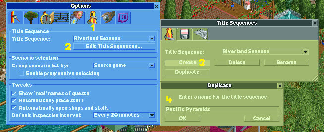
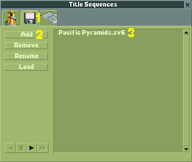
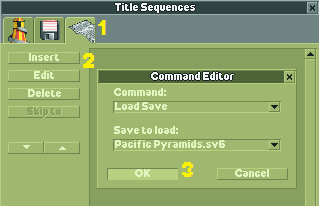
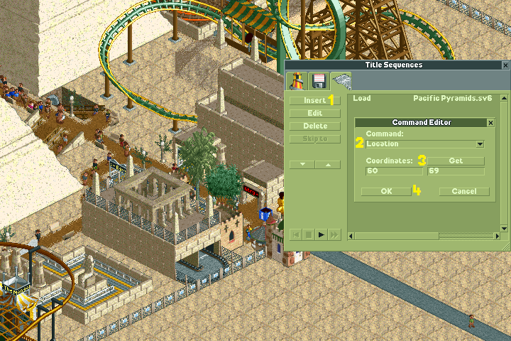
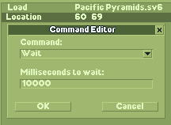
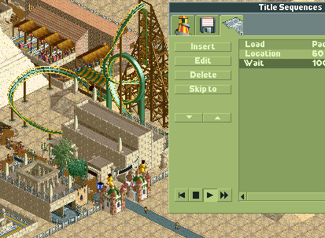
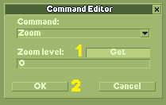
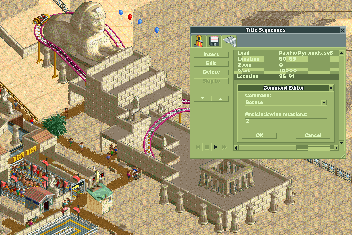
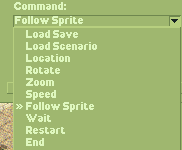

Creating a title sequence
=========================

One of OpenRCT2's unique new features is the ability to make your own title sequences. These are made in the title sequence editor, which uses a series of simple commands to dictate where the camera goes and how long it stays in one location.

Starting the title sequence editor
----------------------------------

The title sequence editor can be loaded at any point in the game from the options menu. The editor is located in the tab with the spiral slide. (1). To create a new title sequence, click “Edit Title Sequences” (2) and click Create (3.) A window will appear asking for a name. Enter the name and click OK (4).

Loading a park
--------------

Once your title sequence is created and named, you'll still need to add it to the sequence. Go to the floppy disk tab (1) and click Add (2). A window will pop up with all your parks listed, much like the regular load save window. Click the park you want and it will appear in the list of parks in the title sequence. (3) You can add multiple parks to a title sequence, but for simplicity's sake, we'll just be using this one.

From there, go to the last tab in the title sequence page, the command editor (1). Click Insert (2) and select “Load Save” from the command drop-down list. The park(s) you added in the floppy disk tab will appear in the “Save to load” drop-down window. Since we're only using one park, it will be the only park that appears in the list. Select your park and click OK (3). The command to load the park will appear in the title sequence editor.

Location
--------

Before we do anything else, it's a good idea to go back to the floppy disk tab and load the park you're using by clicking on it and then clicking Load. This will load the park and allow you to freely navigate.

One of the two most important commands in a title sequence is Location. This command uses a pair of coordinates to tell the camera where to be. Click Insert again (1) and select Location from the drop-down Command list (2). If you position the camera on where to start before inserting the command, your location will automatically appear in the coordinates. However, should you want to change the location after inserting the command, move the camera where you want it to be and click Get (3). This will change the coordinates to your current location. Once you're satisfied with your coordinates, click OK (4).

Something worth noting is the location command can be finicky and not be exactly where you want it to be. If this is the case, select the location command once it's in the list and click Edit. From there, you can tweak the coordinates until you're satisfied. It might be helpful to do shrink the OpenRCT2 window to the smallest possible size (the resolution you see in this screenshot) when selecting my coordinates so that you can centre them more easily.

Wait
----

The second of the two essential commands is Wait. This command tells how long the camera stays in a certain location. The default time is 10,000 milliseconds, which translates to 10 seconds. While it may be tough to get used to milliseconds (removing the last three zeroes is an easy way to convert from milliseconds to seconds), this allows for more precise timing in title sequences.

The wait command is inserted in the same way as the location command, with the only variable value being the length of the wait. However, the wait command needs to come after location or any similar commands, as placing it above them will render them useless.

Playing and Zoom
----------------

Now that we've added a sequence of commands to our title sequence, it's a good idea to preview your title sequence to make sure it looks good. To preview the title sequence, click the play button which is being pressed in the screenshot. When we play our sequence, we notice the screen is zoomed out a bit! This isn't what we want, so we'll need to add a zoom command.

Click Insert again and change the command to Zoom. Zoom in to the desired level (location doesn't matter) and press Get (1). Press OK once you're satisfied with your zoom level (2).

Title sequences can get long, and playing the whole thing just to check one part is very tedious. This is where Skip To comes in. While playing a title sequence, clicking a command in the title sequence editor and then clicking Skip To will skip to the selected command. It's very useful for longer title sequences.

Rotate
------

The ride pictured below would make a great focal point for our title sequence, but we need to rotate the camera to see it properly. This means that along with the location and wait commands, we'll need a rotate command as well. One anticlockwise rotation is equal to one click of the rotate button in regular gameplay. Since the angle we want requires two presses of the rotate button, we'll need to enter a value of 2 into the anticlockwise rotations. Remember to put the wait command after the location and rotate commands!

Follow Sprite
-------------

After our first two shots, we have a nice view of Ozymandias' Revenge curving around this fountain. We could keep the camera here and watch it run its course, but it would pick up the pace if we followed it to the station.

As usual, insert a new command and change the command to Follow Sprite (1). Click Select Sprite (2) and click the sprite you want to follow. In this case, we'll be following Ozymandias' Revenge, so we'll click on the first car of the train. (You can select the other cars of the train as well.) The window under the Select Sprite button should change based on what you selected. Click OK after you're satisfied with the sprite you want to click (4). It's worth noting this doesn't require a location command since our location is focused on the coaster, although you could use a rotate command if you want to change the angle.

.. image:: _static/sequences_follow_sprite.png

Follow Sprite isn't just limited to tracked rides. You can also follow guests and staff! Additionally, following a flat ride centres the camera on the ride without the use of a location command.

Other commands
--------------

There are many more commands you can use in a title sequence. Load Scenario is self-explanatory; it loads a scenario from the scenario selection screen instead of a save game. You can use multiple load save/scenario commands in a title sequence if you want to feature multiple parks. Just place one after a wait command and continue the process as normal.

Speed is an easy command to use. Just place one alongside a location command and change the speed to your desired setting. The speed settings are the same as the ones ingame; normal, quick, fast, and turbo. However, hyper speed is unavailable for use in title sequences. A title sequence should end with a Restart command.

Conclusion
----------

A good idea is to open the default title sequences in the title sequence editor and analyze them. Observe where they choose to focus and how long they stay there. The first shot of RCT1's title sequence has become iconic not just among the RCT community, but among many gamers as a symbol of PC nostalgia.

Even when you master the commands of the title sequence editor, you can still go further. Tell stories with your title sequences. Take viewers on a tour of your favorite park. Have a title solely focused on following your favorite roller coaster or a train that goes around the park. You could even make a stop motion animation using quick wait commands! The title sequence editor has limitless potential, and it's up to you to determine what you do with it.
