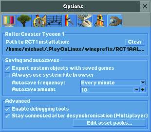

Linking to your RCT1 installation
=================================

OpenRCT2 can pick up RCT1 scenarios, title sequences and image data (giving improved appearance to some roller coaster types). To do this, you need to link to your RCT1 install.

First, make sure that RCT1 is installed. This works in much the same way as installing RCT2 and is covered in the operating system-specific guides you saw earlier. Afterwards, launch OpenRCT2, open the Options menu (top right on the title screen) and go to the sixth tab (the spanner). If you see a path listed under “Path to RCT1 installation”, you are already set. If not, continue with the following steps.

Click the box under “Path to RCT1 installation”. A folder selection dialog will pop up - navigate to the folder where your RCT1 files are and click ‘Open’. After a restart, you should now have access to the RCT1-specific content.
