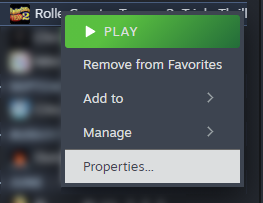
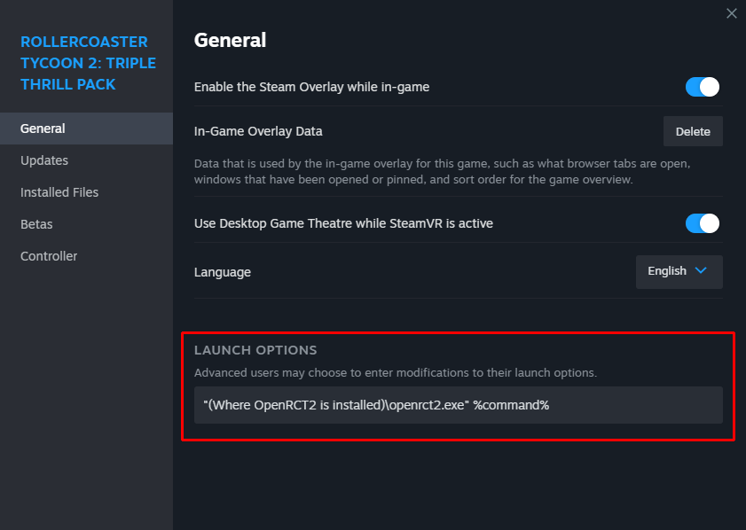

Link OpenRCT2 with Steam
========================

After you have installed OpenRCT2, you may want to link it with Steam's RollerCoaster Tycoon 2: Triple Thrill Pack to record the playtime or something.

Select *RollerCoaster Tycoon 2: Triple Thrill Pack* in your Steam's library and right-click it. Then click **Properties**

Check the directory where you have installed OpenRCT2, and input ``"(directory where OpenRCT2 is installed)/openrct2.exe" %command%`` in the **Launch Options**.

For example, ``"C:\OpenRCT2\openrct2.exe" %command%`` if you have installed OpenRCT2 in ``C:\OpenRCT2``.

And it's done! Now you can play OpenRCT2 with Steam.
