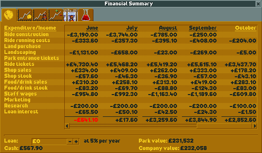

.. _finances:

Finances
========

Most (but not all) scenarios in OpenRCT2 require you to manage money. This manifests itself in multiple ways:

* You have to make sure you don't run out of money.
* Most scenarios either allow asking a park entry fee or a fee per ride, but not both.
* Some scenarios also have objectives that involve money, like achieving a certain park value or selling a certain amount in your :ref:`shops <shops_and_stalls>`.

Income and expenses types
-------------------------

In OpenRCT2, income and expenses are divided into 14 groups:

* **Ride construction:** Costs incurred when building or extending rides. This includes shops and stalls.
* **Ride running costs:** Tracked rides have variable running costs (based on how large and extravagant they are), while flat rides and shops have fixed running costs (not counting shop stock).
* **Land purchase:** Some scenarios allow you to buy additional land or construction rights. While the cost per square might look low, keep in mind that you often need to buy quite a few squares to fit new rides.
* **Landscaping:** This includes raising/lowering land and placing scenery. Raising and lowering land can cost a lot of money.
* **Park entrance tickets:** Self-explanatory.
* **Ride tickets:** Self-explanatory.
* **Shop sales:** :ref:`Shops <shops_and_stalls>` are cheap to build, but provide some additional income, as well as keeping your guests happy. Includes on-ride photo sales.
* **Shop stock:** Self-explanatory.
* **Food/drink sales:**: See “Shop sales”.
* **Food/drink stock:** Self-explanatory.
* **Staff wages:** These are paid every week. You can see how high the wages for every staff member are in the :ref:`Staff window <staff_window>`.
* **Marketing:** Marketing brings extra guests to your park. This costs money, but successful campaigns pay for themselves.
* **Research:** Researching new rides and scenery costs money, but you can set the amount of funding in the Research window.
* **Loan interest:** Paid every week. 

Managing finances
-----------------

You can open the Finances window in three ways:

* By clicking the amount of money you have:

  .. image:: _static/bottom_toolbar_money.png

* By clicking the button in the toolbar, if you have it enabled:

  .. image:: _static/finances_toolbar_button.png

* By pressing the hotkey (defaults to ``F``).

The window will now open. There are six tabs:

* **Financial Summary:** provides an income/expenditure table, lists current loan, park value and company value and allow setting your loan.
* **Financial Graph:** shows your cash (minus loan) over time.
* **Park Value Graph:** shows your park value over time.
* **Profit Graph:** shows your weekly profit over time.
* **Marketing:** allows you to start new marketing campaigns, and lists which ones are currently running.
* **Research Funding:** allows you to set how much money to spend on R&D every month, as well as which areas should have priority.

