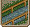
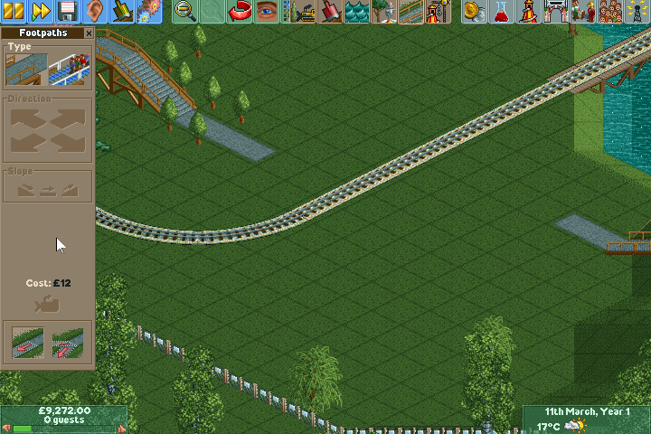

.. _footpaths:

Footpaths
=========

Footpaths allow guests and staff to walk between your park entrance, rides and shops. They can also be used as decor for your park as footpaths come in different styles and colours.

There are two types of footpath:

* Footpaths - used as a means of navigation.
* Queues - used to allow guests to form queue lines for rides.

Placing Footpaths
-----------------
Open the footpath window by pressing toolbar button below or the default keyboard shortcut ``F4``.

The bottom left toggle button will enable the place footpath tool. After enabling this, you can click any suitable map tile within the park to place footpath at. You can also drag the cursor along the map to place a strip of footpath. Footpaths will automatically connect together to form junctions or wide paths.

.. image:: _static/footpath_simple.gif

You can construct bridges by left clicking the bridge button and then navigating the footpath marker in the desired direction using the direction and slope toggle buttons.

