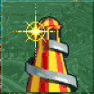
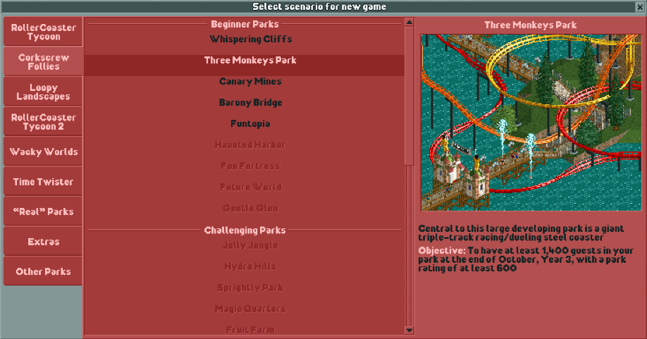

Getting Started
===============

In OpenRCT2, there are two main game modes - Scenario mode and Sandbox mode.

Scenario mode features pre-created parks designed to challenge your management skills. Certain parts of the game are constrained, like the land you are allowed to build on, the amount of money you have, or even how high above the ground you are allowed to build!

Sandbox mode, on the other hand, allows you to create anything you can think of, free of the restrictions seen in scenario mode.

Starting a Scenario
-------------------

To start a new scenario, click on the "Start a new game" button.

This will bring up a menu with many different scenarios to choose from. By hovering over the names of the parks, you can see a brief description of the scenario along with its objective. The first objectives are mostly to build parks with a certain rating and number of guests by a certain time period. As you unlock more scenarios, different kinds of objectives become available.

Starting a Sandbox
------------------

Starting a sandbox park can be done in two main ways. The first is to find a sandbox or "workbench" park save file from another player and load it. Typically these parks have a number of pre-selected scenery objects and rides, a large park area to work on, and unlimited money with no objective. This method of starting a sandbox is the easiest once you have a file acquired.

The alternative is to utilize the scenario editor feature to create a sandbox save. More information can be found in the 'Scenario Editor' section.
