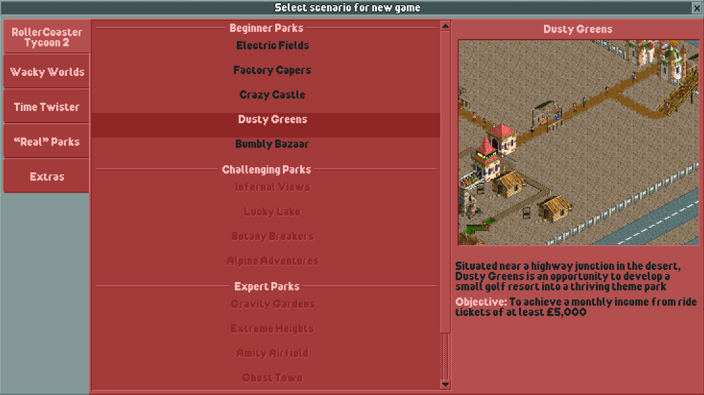

Getting Started
===============

OpenRCT2 features a number of challenges known as scenarios. Scenarios feature pre-created parks designed to challenge your management skills. Certain parts of the game are constrained, like the land you are allowed to build on, the amount of money you have, or even how high above the ground you are allowed to build!

In addition to constraints in the scenario itself, each scenario has an objective that must be fulfilled. The first objectives are mostly to build parks with a certain rating and number of guests by a certain time period. As you unlock more scenarios, different kinds of objectives become available.

If you are interested in designing your dream park with no constraints or objectives, there are ways to emulate a “sandbox mode” by using the built-in cheats of OpenRCT2.

Starting a Scenario
-------------------

To start a new scenario, click on the “Start a new game” button.

.. image:: _static/new_game_button.png

This will bring up a menu with many different scenarios to choose from. By hovering over the names of the parks, you can see a brief description of the scenario along with its objective.

Clicking on the title will start the scenario, which will load the park and start the game.
