Landscaping
===========

The landscaping tools provided in OpenRCT2 enable you to create a wide variety of landscapes, ranging from rolling hills to jagged mountainsides.

In addition, certain scenarios allow you to purchase addition land for building and development.

Adjusting Terrain
-----------------

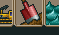

The terrain tool is in charge of manipulating the park's terrain, in both the 3D slopes and texture.

To use the tool, hover the cursor over the tiles that you want to manipulate. Then, click and drag up or down to raise or lower the terrain.

Other than just raising and lowering terrain, there are a couple of modifications that can be made.

The top left button enables/disables the mountain tool. Instead of creating sheer cliffs and holes, the mountain tool tries to create hills and valleys by placing sloped ramps wherever it would create an edge.

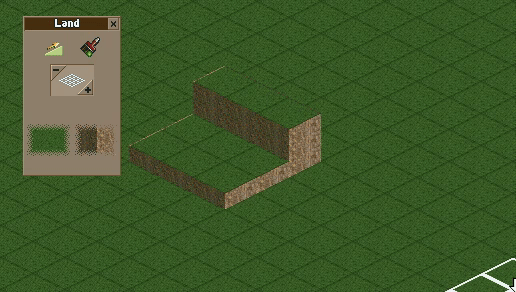

To adjust the size of the tool's area of effect, use the -/+ buttons, or click in the middle of the grid icon to specify a number.

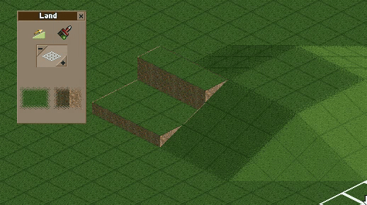

To change the texture of the terrain, click and hold on the lower left button to select a land type, and do the same for the lower right button to select a vertical face type.

When the button is pressed, using the landscaping tool will change the selected tiles to match the selected textures.

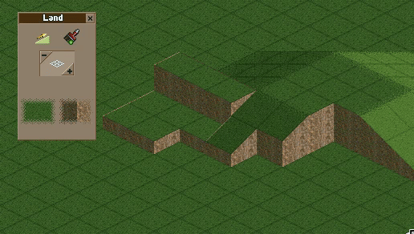

If you only want to change the texture of the terrain, you can toggle the paint tool by selecting the paintbrush in the top right of the menu. This turns the cursor into a paintbrush that can be moved over tiles while holding the mouse button, painting tiles underneath with the selected land and face textures.

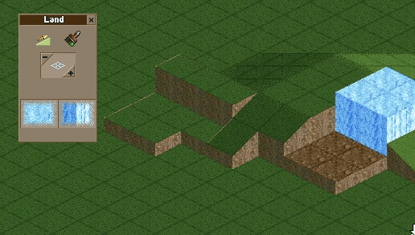

When the tool only affects one tile, the tool is able to manipulate the individual corners of a tile.

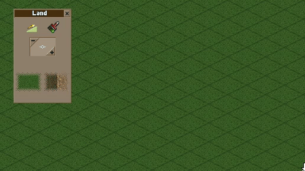

Adjusting Water
---------------

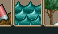

To manipulate water features, use the water tool. This tool allows you to add water to any tile. It is extremely similar to the terrain tool. Click and drag up or down to raise or lower the water in the affected tiles.

To change the size of the tool's area of effect, use the -/+ buttons, or click in the middle of the grid icon to specify a number.

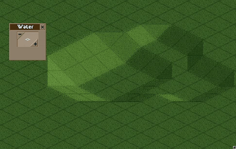

The water tool will typically follow the curves of the landscape it is on, though if raised up above the terrain's height, will create its own retaining walls based on the terrain below it.

.. image:: _static/water_lowering.gif

Purchasing Land
---------------

In some scenarios, you have the ability to purchase land to expand your park's usable area. To see what land is available for purchase, click the park information button, then click on the land and construction rights button.

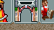

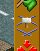

Land for sale comes in two different options - land for sale, and construction rights for sale.

Land for sale means that, when purchased, the land becomes a part of your park, and can be modified in any way - raise/lower, change terrain, build on top of it, etc.

Construction rights for sale means that, when purchased, the land can be built over or under, but otherwise cannot be modified or built directly on top of.

To view a park's available land for purchase, click the land and construction rights button. This opens the land rights menu. From here, you can toggle which type of available land you want to see. The left button toggles land for purchase, while the right toggles constructions rights for purchase.

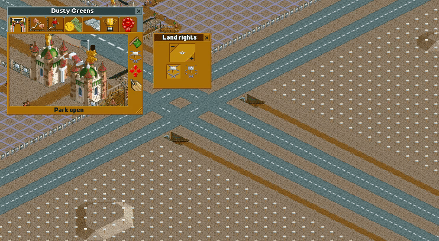

While this menu is open, land that your park already owns will show with a solid purple outline, while construction rights your park already owns will show up with a dotted purple line.

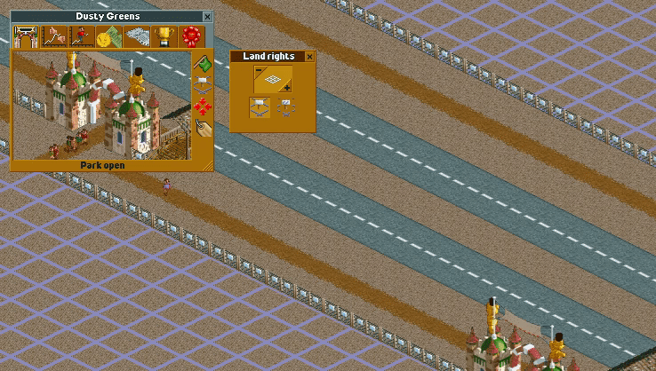

To actually purchase the land, hover over a map tile that can be purchased and click. Just like the terrain tool, the size of land purchased can be adjusted using the -/+ buttons, or by clicking on the grid icon. Note that the price of the land being purchsed is shown at the bottom of the land rights menu.

.. image:: _static/land_purchasing.gif
