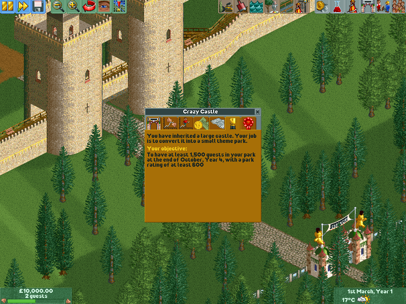
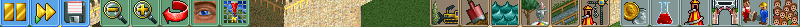

Main interface
==============

When you open a new game (or load a saved game), you will be presented with the following interface:

The above screenshot contains four parts:

1. The **top toolbar**. This has options for pausing, loading and saving your game; modifying views; adding new things to your park and managing it.
2. The **bottom toolbar**. This consists of the two green blocks in either bottom corner, as well as the news bar, which will appear between them if a news message arrives.
3. The **park window**. This window will open automatically if you start a new game. The window shows some statistics, allows changing the admission price and shows your objective.
4. The **viewport**. This consists of everything not covered by a toolbar or a window and provides a view on your actual park.

The top toolbar
---------------

The top toolbar is divided into four groups.

The first group consists of:

1. The **pause button**. Click it to pause the game. Click it again to unpause. When your game is paused, you won't be able to build.
2. The **fast forward button**. This speeds up the time (up to 8×). This can be useful if you need to wait for an event to happen (like earning money or invention of a ride).
3. The **disk options button**. This allows you to start a new game, load or save, take a screenshot, modify options or quit the game.

The second group consists of view options:

1. The **zoom out button**. This allows you to get a better view of your park, at the cost of some detail.
2. The **zoom in button**  This allows you to take a closer look.
3. The **rotate view button**. The will rotate the view by 90 degrees.
4. The **view options button**. Allows you to hide elements from the map and look underground.
5. The **map button**. Will open the Map window, which shows an overview of your park.

The third group consists of build options:

1. The **clear scenery** button. This allows you to clear large spaces easily. (It can optionally also clear paths.)
2. The :ref:`land button <land_window>`. Allows you to change land types and change elevation.
3. The :ref:`water button <water_window>`. Allows you to change water levels.
4. The **scenery button**. Allows you to place scenery, which makes your park more beautiful.
5. The :ref:`footpaths button <footpaths>`. Allows you to place footpaths and queue lines.
6. The **new rides button**. Opens up a window that allows you to build new rides in your park.

The fourth group consists of management options:

1. The :ref:`finances button <finances>`. This gives you insight into your finances and allows you to take out loans and marketing campaigns.
2. The **research and development button**. This gives you access to research and development settings, including funding, priorities, and checking status of the current invention.
3. The **rides list button**. Shows a list of rides, shops and stalls, and facilities.
4. The **park window button**. This opens up the park window (note that it is already open in the screenshot at the top of this page).
5. The :ref:`staff button <staff>`. Allows you to hire and sack staff, check their status and assign them to specific areas.
6. The **guest list button**. This shows all your guests. You can use this to see what your guests want or need to improve their visit (and thus increase your park rating).

Besides these, there are also some additional buttons that are not shown by default, but which can be enabled in the Options window.
