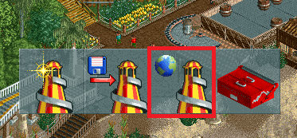
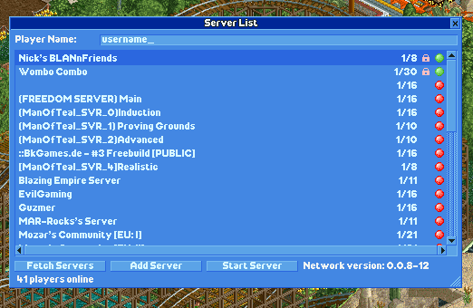

Multiplayer
===========

Multiplayer is a new game mode introduced in OpenRCT2 that allows two or more players to cooperatively play and build on the same park. Similar to games like OpenTTD and MineCraft, a server can be setup which runs a game allowing players to connect to it. When a player joins a server, the park will be downloaded to the client allowing them to play it.

The multiplayer window can be accessed from the main menu screen via the Multiplayer button at the bottom of the screen:

Connecting to a server
----------------------

When you open the multiplayer window you will see a list of public servers and servers you have saved. Type your name or alias into the player name field - this is the name that will be shown to other players in multiplayer games. 

Note the red and green circles on the right hand side, and the text in the bottom right referring to the network version. You can only connect to servers that are on the same network version as you. Hovering over the circles will tell you what version the server is running. If it is higher than yours, update your copy of OpenRCT2. If it is lower than yours, you'll need to contact the server admins and ask them to update.

To connect to a server, click and hold the server you would like to join and then click "Join server" from the popup menu. If the server is password protected you will need to enter in the correct password to join. The park will then be downloaded to your client, this make take a few seconds to a few minutes depending on the speed of the connection from the server to your client and the size of the park.

If you want to join a server that is not advertised on the public server list, you must click the "New server" button and enter the hostname or IP address (and optionally a port if the server is not using the default OpenRCT2 port, 11753). Upon doing this, the server will be saved to your server list so you do not have to type the address in every time you want to join it.

Starting a server 
-----------------

If you want to start a server for your friends to join, you can start a new server from within the game and then immediately play on it. This can be done by clicking "Start Server" and loading a saved game. If you do not want your server to be listed on the public server you must make sure you have the "Advertise" option unchecked.

If you are setting up a public server or are not on the same local area network as your friends - you must make sure that your server can be accessed from outside your local area network. If you are behind a router with Network Address Translation (NAT) enabled (very likely), you must configure your router to forward TCP connections on your chosen port (default is 11753) to your computer. Configuring your router will vary between router brands and will not be covered in this documentation.

Starting a server (Advanced)
----------------------------

OpenRCT2 supports headless mode, useful for dedicated servers. You can enable headless mode by running:

``openrct2 host <saved game path> --headless``

Additional arguments can be used to change the behaviour of the server.

======================   =============================  ==================================================
    Argument                 Variable                     Description
======================   =============================  ==================================================
 ``--console``             N/A                             Keeps the console window open (only on Windows)
 ``--headless``            N/A                             Runs OpenRCT2 without graphical interface
 ``--help``                N/A                             Prints out help for CLI 
 ``--port``                Port Number                     Changes the server port number
 ``--user-data-path``      Path to config.ini folder       Changes the server configuration data path
 ``--verbose``             N/A                             Output additional information to the console
======================   =============================  ==================================================

Example (Windows): ``"C:\MyOpenRCTInstall\openrct2.exe" host "C:\MyServerSaves\MyServer.sv6" --port 11753 --headless --console --verbose --user-data-path "E:\MyServerConfig"``

Additional server information can be changed in the ``config.ini`` file. In Windows, by default, this is located under ``"%userprofile%/Documents/OpenRCT2/"``
