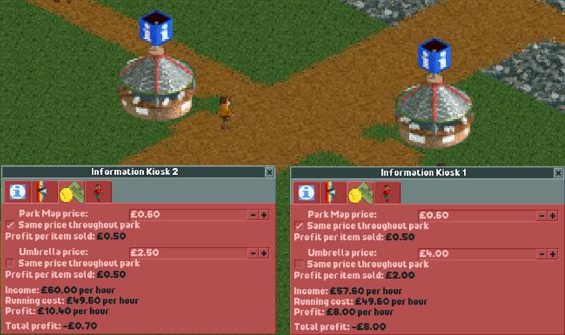
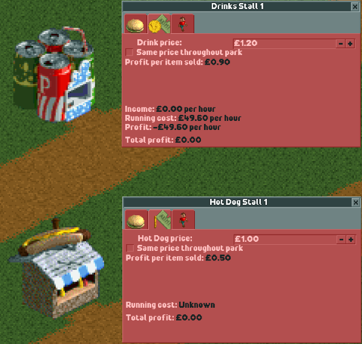
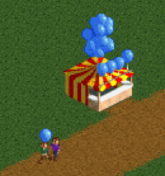

Shops & Stalls
==============

Some of the simplest buildings in the game are the many shops & stalls available to be built. Many of these shops sell one or two small items: a meal, a drink, or some souvenir of your park. While very cheap to build, they don't turn too large of profit. Managing the different aspects of shops & stalls can help to get some supplemental cash flowing, and in some cases, is actually the objective of the scenario!

General Information
-------------------

Pretty much all shops & stalls follow the same basic principles - they cost some flat amount hourly, and sell one or two items. The price of the items can be set using the plus and minus keys next to the input box, or by clicking on the box itself and setting a new value. Balancing the price between selling lots of cheap items versus a handful of pricey items is key!

For convenience, you can tick the "Same price throughout park" checkbox to make items match prices across all stalls. This will toggle the box for all shops & stalls at the same time.

Types of Shops & Stalls
-----------------------

Shops & stalls fall into a handful of categories. These categories are:

* Food and Drink
* Souvenir
* Utility

Food and Drink
^^^^^^^^^^^^^^

Many stalls will sell food or drinks. These stalls are used to satisfy the hunger and thirst of your guests. Some stalls, such as the Coffee Shop, can also increase a guest's energy.

Guests will also prefer certain drinks depending on the climate of the park. In hot and dry deserts, guests will want to drink lemonades and eat ice cream, while in cold weather they will prefer hot chocolate.

Souvenir
^^^^^^^^

Some stalls sell souvenir items to your guests. These items can make guests happier while also making a profit.

Utility
^^^^^^^

The last group of stalls have some specific functional purpose in your park. There are only a handful of shops & stalls in this category.

* **Information Kiosk** - These stalls sell park maps and umbrellas, as well as being the only stall to connect on all sides. Park maps help keep guests from feeling lost, while umbrellas keep peeps from getting negative thoughts in the rain. Guests are very eagar to buy umbrellas when it starts raining, so prices can be set high to earn a large profit!
* **First Aid Room** - This stall is special in that it cannot charge a fee for usage. This stall treats guests feeling sick by reducing their nausea. By building a First Aid Room near the exits of your more nauseous rides, you can keep your footpaths clean of vomit.
* **Cash Machine** - This stall allows your guests to withdraw money so that they can continue to spend money in your park. As your park gets bigger with more rides, your guests may start to run out of money before they actually want to leave. Make sure that you are keeping them in the park and spending money!
* **Toilets** - Toilets allow your guests to relieve themselves, lowering their 'toilet' stat. In addition, sick guests will occasionally use toilets to reduce nausea if necessary. You can choose to charge guests for the toilet if you are feeling particularly... business-savvy.

.. figure:: _static/raining_umbrellas.gif

    Guests using umbrellas and checking maps near two Information Kiosks

.. figure:: _static/first_aid_treatment.gif

    A sick guest having their nausea treated at a First Aid Room
