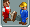

.. _staff:

Staff
=====

Every park needs several staff members to keep the guests happy and the rides working. To accomplish these goals, OpenRCT2 has four types of staff:

* Handymen - these clean up litter, water gardens and optionally mow the grass.
* Mechanics - these fix and check your rides.
* Security guards - these keep vandals at bay.
* Entertainment - these keep your guests entertained and happy, especially in long queue lines.

.. _staff_window:

Using staff
-----------
Open the staff window by pressing the toolbar button below or the default keyboard shortcut ``S``.

This will open the staff window:

.. image:: _static/staff_list.png

Every staff member mentioned in the preceding section has its own tab. Every tab contains a button to hire extra staff members and contains a list of existing members. To open a window for a particular staff members, simply click their name in the list. 

.. image:: _static/staff_handyman_window.png

This will open a window which you can use to move, rename and fire that staff member, as well as setting an area in which the staff member should operate. Setting one can prevent staff members from bunching up in one area and neglecting others.
Handymen, mechanics and entertainers also have a second tab which controls the activities the staff member should carry out (for handymen and mechanics) and which costume to wear (for entertainers).

Every staff member has a salary, which differs per staff type. The amount of it is also displayed on every tab. You will need to find a balance between hiring enough staff members in order to keep your park running smoothly, and keeping the costs down.
