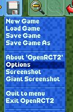

Options
=======

The options menu can be accessed by clicking the options button in the top right of the screen on the main menu, or by clicking the “Options” selection in the “Disk and game options” dropdown while playing in a park.

There are a number of options for OpenRCT2 that can be tuned to fit your preferences and needs. They are broken up into a number of different sections.

Display
-------

There are a number of options dedicated to how the game runs on your screen.

* **Screen mode**

  Can be one of three values:

  * *Windowed* - the game will run inside a window with standard decorations like minimise and close buttons.
  * *Fullscreen* - the game is allowed to take over the screen output, allowing the game to achieve better performance than Fullscreen (borderless window). Switching to and from the window (such as through Alt+Tab) will cause a short delay.

    * When Fullscreen is selected, you can also select the Display Resolution the game should run at. The options available depend on your monitor.

  * *Fullscreen (borderless window)* - exactly like Windowed, but with no window decorations, allowing the game to take up the entire screen space.

* **Window scale factor**

  Determines the scale the game will be rendered at. At ``1.00`` scale factor, the game runs at its original scale of 1 game pixel to 1 screen pixel. This setting is useful for larger resolutions, where this scale makes the UI extremely small and otherwise unusable. At non-integer values, this enables the *Scaling quality* setting below.

* **Drawing Engine**

  Can be one of three values:

  * *Software* - the game uses a software renderer based on the CPU to render and draw the game.
  * *Software (hardware display)* - the game uses a software renderer based on the CPU to render the game, while it uses the hardware device to draw the rendered image to the screen.
  * *OpenGL (experimental)* - the game uses OpenGL to render and draw the game.

  Selecting a hardware renderer (*Software (hardware display)* or *OpenGL*) enables **Scaling quality** if the **Window scale factor** is not an integer, **Pause game when Steam overlay is open**, and **Use vertical sync**.

  * **Scaling Quality**

    Requires a hardware renderer. Can be one of two values:

    * *Linear* - Scaling is smooth, but blurry.
    * *Smooth Nearest Neighbour* - Scaling is sharp but takes a bit more performance.

    .. figure:: _static/scaling_quality_linear.png

       Linear

    .. figure:: _static/scaling_quality_smooth.png

       Smooth Nearest Neighbour

  * **Pause game when Steam overlay is open**

    Requires a hardware renderer. Enables the game to be paused when using the Steam overlay.

* **Uncap FPS**

  When disabled, the framerate is capped at 40. When enabled, allows the framerate to run higher by generating in-between frames for smoother gameplay.

* **Show FPS**

  When enabled, shows a small number at the top of the screen of the current framerate.

* **Use vertical sync**

  When enabled, attempts to synchronise frames with the monitor's refresh rate, preventing screen tearing.

* **Multithreading**

  Experimental option which, when enabled, uses multiple threads to render.

* **Minimise fullscreen on focus loss**

  When enabled, if the mouse cursor leaves the window in fullscreen mode, minimise the game to the taskbar.

Rendering
---------

* **Landscape Smoothing**

  Enables/disables landscape smoothing on grid edges.

  .. image:: _static/landscape_smoothing.gif

* **Gridlines on Landscape**

  Enables/disables gridlines on the landscape.

  .. image:: _static/landscape_gridlines.png

* **Display text on banners in uppercase**

  If enabled, displays the text on banners (ride entrances, signs) in uppercase.

  .. figure:: _static/banner_text_uppercase.png
     :scale: 200 %

     Uppercase text

  .. figure:: _static/banner_text_lowercase.png
     :scale: 200 %

     Upper and lowercase text

* **Show guest purchases as animation**

  If enabled, shows when guests make a purchase as floating green text.

  .. image:: _static/show_guest_purchases.png

* **Transparent background for giant screenshots**

  If enabled, giant screenshots will have a transparent background where the outside of the park would normally be, instead of the dark void.

* **Virtual floor style**

  Can be one of three values:

  * *Disabled* - No virtual floor is shown when building scenery off ground level.
  * *Clear (Transparent)* - An outline of the current building grid is shown beneath the scenery object being placed.
  * *Glassy (Translucent)* - An outline of the current building grid is shown beneath the scenery object being placed, and the interior of the grid is a translucent olor.

  .. image:: _static/virtual_floor_disabled.png
     :scale: 70 %

  .. image:: _static/virtual_floor_clear.png
     :scale: 70 %

  .. image:: _static/virtual_floor_glassy.png
     :scale: 70 %

* **Cycle day / night**

  If enabled, the game will cycle between day and night cycles, causing the colour palette to change.

  .. image:: _static/day_night_cycle.gif

  * **Enable lighting effects**

    If enabled, light-producing items such as lamps will emit a glow during nighttime and rainstorms.

    * **Enable lighting effects on rides**

      If enabled, some rides will emit a glow during nighttime and rainstorms.

* **Render weather effects**

  If enabled, rain and gloomy colours will be rendered during storms.

  * **Disable lightning effect**

    If enabled, the lightning effect during thunderstorms will not occur.

Culture and Units
-----------------

* **Language**

  Used to select the language OpenRCT2 uses.

* **Currency**

  Used to select the currency OpenRCT2 uses.

  Selecting “Custom currency” will bring up a menu allowing you to specify a currency not built into OpenRCT2.

  .. image:: _static/custom_currency.png

* **Distance and Speed**

  Used to select the units for distances and speed. Can be one of three values:

  * *Imperial* - ``ft`` (feet) and ``mph`` (miles per hour)
  * *Metric* - ``m`` (metres) and ``km/h`` (kilometres per hour)
  * *SI* - ``m`` (metres) and ``m/s`` (metres per second)

* **Temperature**

  Used to select the units for temperature. Can be either ``Celsius`` or ``Fahrenheit``.

* **Height Labels**

  Used to select whether to show unit values (``+1``, ``-4``, etc.) or real values (``1.5m``, ``-6m``, etc.).

  .. image:: _static/height_units.png

  .. image:: _static/height_real_values.png

* **Date Format**

  Used to select the date format. Can be one of four values:

  * *Day/Month/Year*
  * *Month/Day/Year*
  * *Year/Month/Day*
  * *Year/Day/Month*

Audio
-----

* **Audio Device Dropdown**

  The first dropdown on the Audio tab is a selector for the audio device that OpenRCT2 will use.

* **Master volume**

  A slider used to adjust the volume of OpenRCT2.

* **Sound effects**

  A slider used to adjust the volume of sound effects such as opening/closing menus, guest chatter, guest purchases, etc.

* **Ride music**

  A slider used to adjust the volume of ride music.

* **Disable audio on focus loss**

  Enables/disables muting of audio when OpenRCT2 is not the focused window.

* **Title screen music**

  Selects the music that will be used at the main menu for OpenRCT2. Can be one of four values:

  * *None*
  * *RollerCoaster Tycoon 1* - requires RCT1 data to work.
  * *RollerCoaster Tycoon 2* - requires RCT2 data to work.
  * *Random title music* - randomly select any of the options above.

Controls and Interface
----------------------

* **Scroll view when pointer at screen edge**

  When enabled, the view of the park will scroll when the mouse cursor is near the edge of the screen.

* **Trap mouse cursor in window**

  When enabled, the mouse cursor will stay locked inside the window.

* **Invert right mouse dragging**

  When enabled, the behavior when panning the view with the right mouse button will be flipped.

* **Zoom to cursor position**

  When enabled, zooming will center on the cursor's location instead of the middle of the screen.

* **Shortcut keys...**

  A button leading to the keyboard shortcuts menu. This window allows modification of the default keyboard shortcuts, and also allows some other functions to have shortcuts assigned.

  To assign a new keyboard shortcut, click the function, then press the key to assign the shortcut. This key can also have modifiers (Shift, Ctrl, Alt).

* **Current Theme**

  A dropdown allowing selection of the theme for the UI. Themes affect all colors of the windows in the game. By default, there are two options, one which matches RCT1, and another which matches RCT2.

* **Toolbar buttons**

  The toggles in this section affect the visibility of different buttons along the top toolbar.

  * **Finances** - Shows/hides the finances window, where more detailed financial information can be found.
  * **Cheats** - Shows/hides the cheats window.
  * **Research** - Shows/hides the research window, where research priorities can be specified.
  * **Recent messages** - Shows/hides the recent messages window, which contains all text from announcements that appear at the bottom of the screen.
  * **Mute** - When pressed, toggles the master audio for OpenRCT2.
  * **Chat** - Shows/hides the chat window. Only available in multiplayer.

Miscellaneous
-------------

* **Random title sequence**

  When enabled, a random title sequence will be chosen from the available options when viewing the main menu.

* **Title sequence**

  A dropdown containing a list of all available title sequences, which play when viewing the main menu.

  The *Edit Title Sequences...* button can be pressed to manage and edit different title sequences. See :doc:`/advanced/title-sequences/index` for more information.

* **Group scenario list**

  Can be one of two values:

  * *Difficulty Level* - group scenario tabs by their difficulty level, then by their expansion.
  * *Source game* - group scenario tabs by their expansion, then by difficulty. Also allows the **Enable progressive unlocking** toggle, which locks later scenarios from starting before completing earlier scenarios.

* **Enable early scenario completion**

  When enabled, allows certain scenario objectives to be completed before their end date.

* **Show 'real' names of guests**

  When enabled, shows the guest's name instead of the guest number.

* **Automatically place staff**

  When enabled, staff will automatically be placed above a random path, instead of having to be placed manually.

* **Automatically open shops and stalls**

  When enabled, shops and stalls being built will start open instead of closed.

* **Default inspection interval**

  A dropdown which sets the default inspection time of newly built rides.

Advanced
--------

* **Enable debugging tools**

  When enabled, shows a number of features useful for debugging the game.

* **Allow loading files with incorrect checksums**

  When enabled, allows corrupt save files to be loaded to the best of OpenRCT2's ability.

* **Export custom objects with saved games**

  When enabled, saved games will include the custom objects used inside of the map.

* **Stay connected after desynchronisation (Multiplayer)**

  When enabled, the game will continue running after a desynchronisation. Both parks will still run, but they may diverge and behave differently in the future.

* **Always use system file browser**

  When enabled, OpenRCT2 will use the system's default file browser instead of the built-in file browser.

* **Autosave frequency**

  Sets how often OpenRCT2 will autosave.

  Can be one of six values:

  * *Every minute*
  * *Every 5 minutes*
  * *Every 15 minutes*
  * *Every 30 minutes*
  * *Every hour*
  * *Never*

* **Autosave amount**

  Sets the number of autosaves OpenRCT2 will keep before deleting the oldest autosave.

* **Path to RCT1 installation**

  Sets the location of the RCT1 installation on the computer.
